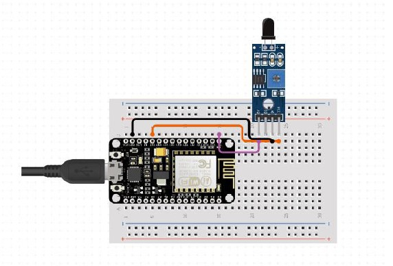

# Forest Fire Detection System

Every year, thousands of forest fires across the world cause disasters that result in loss of vegetation and habitat. India has a forest cover of almost 80.73 million hectares. The different climatic conditions in India make it prone to forest fire.

Forest Fire is one of the main causes of degradation of Indian forests. According to the Forest Survey of India Report, about 50 percent of the forest area in the country is fire prone.

This leads to a lot of loss lives, nature, and vegetation. So, there is a need to devise a method or technology to effectively deal with forest fires.
As per the current situation, only the satellite based traditional methods are in use which are quite ineffective. Hence, a better technology is urgently required for detecting forest fires quickly and effectively. One of them is using Wireless Sensor Networks (WSNs).

We will be using NodeMCU ESP8266 microcontroller for the Forest Fire Detection since this microcontroller is low cost, has an integrated support for Wi-Fi network and reduced size of the board and consumes less energy when compared to traditionally Arduino based systems.

The forest fire will be detected by Flame sensors using a threshold value for the temperature. When a fire is detected, notifications will be sent to mobile phones triggered with an alert message indicating the presence of fire.

The communication is done using MQTT since it is a lightweight publish-subscribe based messaging protocol. We use MQTT because it is faster than other request-response based APIs like HTTP.

### The Arduino IDE was used to develop and import the code into the Node MCU microcontroller.

## Architecture Diagram

## Output

Fire detected

